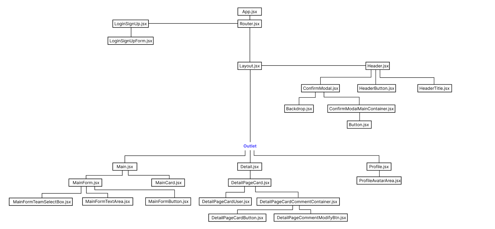

# 내일배움캠프 개인과제 - 팬레터 페이지 리펙토링

## 프로젝트 정보

- 주제 : 프로야구 10개 구단 응원페이지 (기존 Redux 버전 redux-tookit 리펙토링)

- DEMO : https://baseball-team-page-v2.vercel.app/

## 사용기술

- language : JavaScript

- FrameWork : React

- Library :
  - uuid
  - styled-components
  - redux-toolkit
  - axios
  - react-router-dom
  - json-server
  - react-spinners
  - react-toastify

## 컴포넌트 구조

## 주요기능

- 로그인/로그아웃 회원가입 기능

.gif>)

- 로그인 토큰 유지 기능

.gif>)

- 팀별 Theme 변경(styled-components ThemeProvider)

.gif>)

- 응원의 말 CRUD

.gif>)

- 프로필 변경

.gif>)
